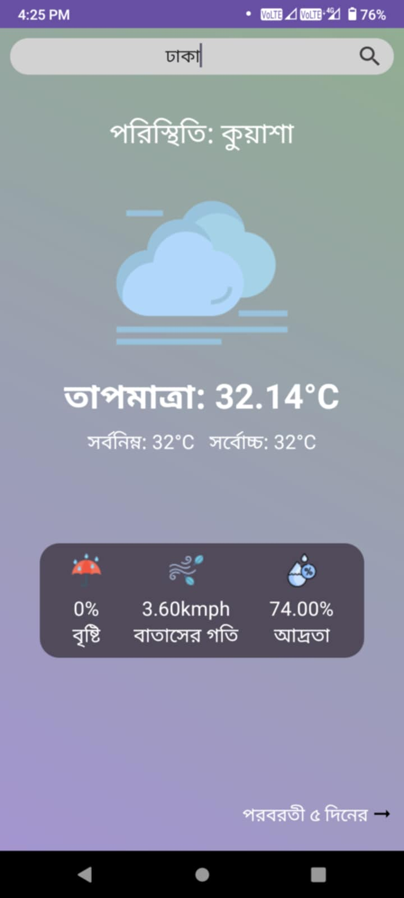
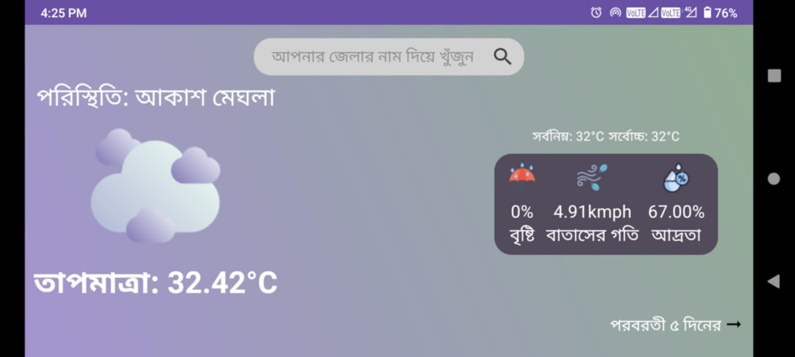
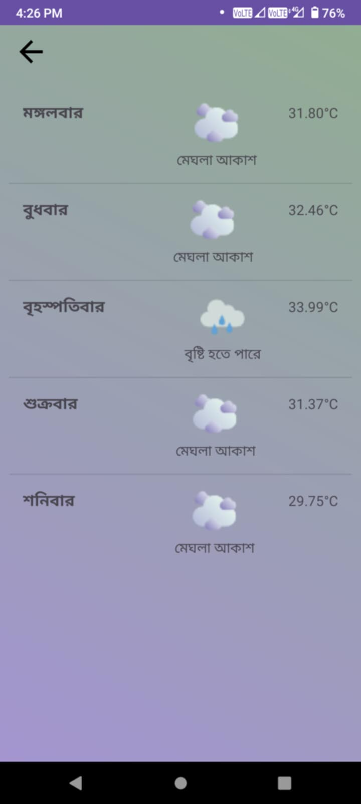

# Weather Forecast: CloudCast App in Bengali



## Table of Contents
- [Introduction](#introduction)
- [Features](#features)
- [Screenshots](#screenshots)
- [Installation](#installation)
- [Usage](#usage)
- [Technologies Used](#technologies-used)
- [Contributing](#contributing)
- [License](#license)

## Introduction
The "CloudCast" Weather Forecast App provides district based weather updates and forecasts in the Bengali language. It is designed to help Bengali-speaking users stay informed about weather conditions in their area.

## Features
- Current weather updates
- 5-day weather forecast
- Weather data in Bengali
- User-friendly interface
- Real-time updates

## Screenshots
 

## Installation
1. Clone the repository:
    ```bash
    git clone https://github.com/mazharul-15/CloudCast
    ```
2. Open the project in Android Studio.
3. Build and run the project on an Android device or emulator.

## Usage
- Open the app to view the current weather conditions.
- Tap on "পরবরতী ৫ দিনের" to view the 5-day forecast.

## Technologies Used
- Java
- Android Studio
- OpenWeatherMap API
- Bengali language support

## Contributing
Contributions are welcome! Please fork the repository and create a pull request with your changes.

## License
This project is licensed under the MIT License. See the [LICENSE](LICENSE) file for details.
